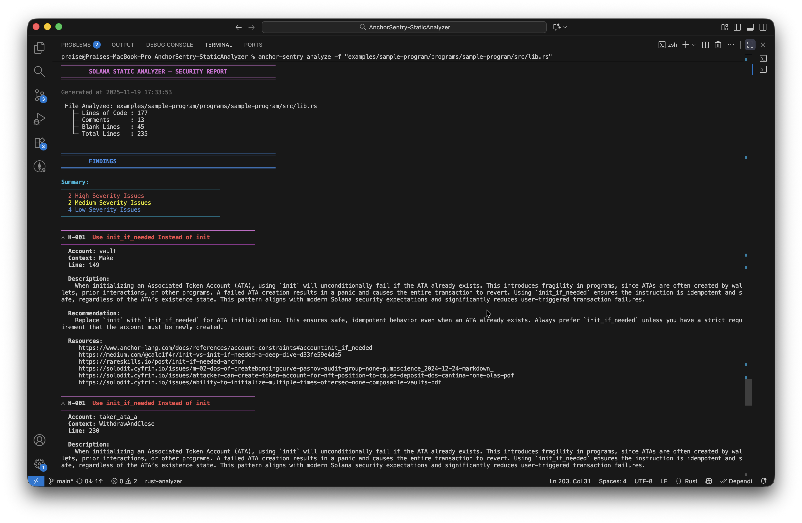
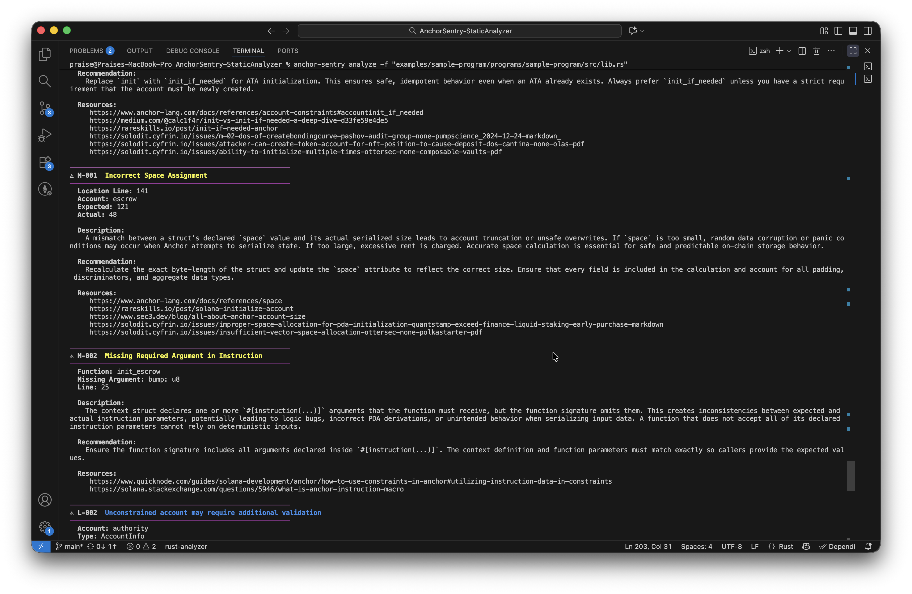
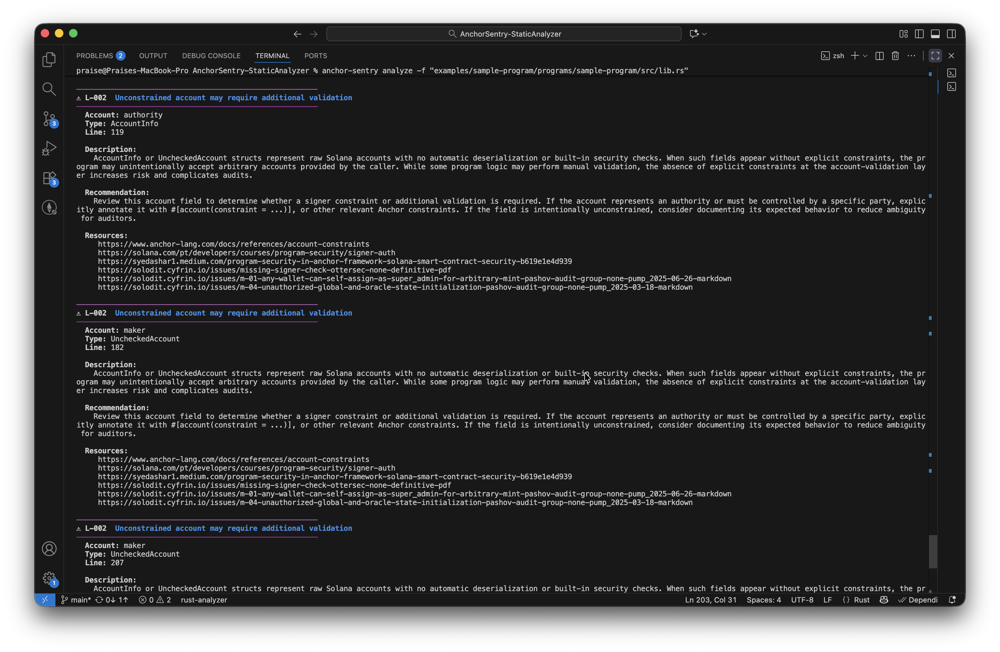
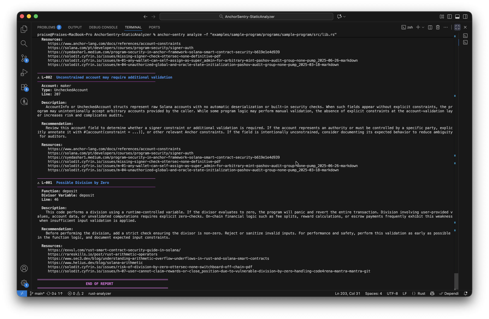

# ⚠ AnchorSentry Static Analyzer  
*A lightweight but powerful static analysis tool for detecting common vulnerabilities, mistakes, and misconfigurations in Solana Anchor programs.*

---

## Overview

**AnchorSentry Static Analyzer** is a command-line tool designed to scan Anchor programs and automatically detect issues present in code.  
It parses a program, normalizes it to form Anchor-specific constructs, runs a series of static security rules, and outputs a clean, readable, well formatted report.

The analyzer is suitable for:

-  **Solana developers**  
-  **Security engineers**  
-  **E-learning platforms** teaching Solana development and security

---

## Installation
```
cargo install --path .
anchor-sentry analyze -f "path-to-program"
```

---

##  Features

### Current Detection Rules
The analyzer currently detects:
```
Finding::MissingInitIfNeeded
Finding::WrongSpaceAssignment
Finding::MissingRequiredInstructionArgument
Finding::PossibleDivisionByZero
Finding::PossibleMissingAccountVerification
```


## Architecture


## Sample-Reports



